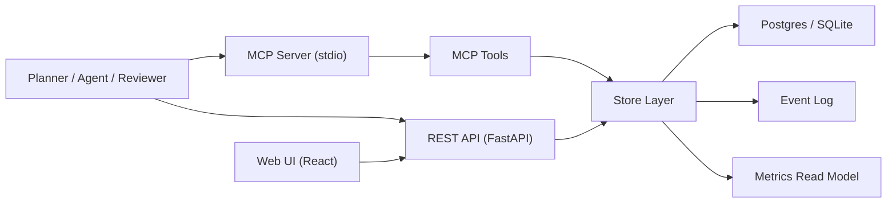
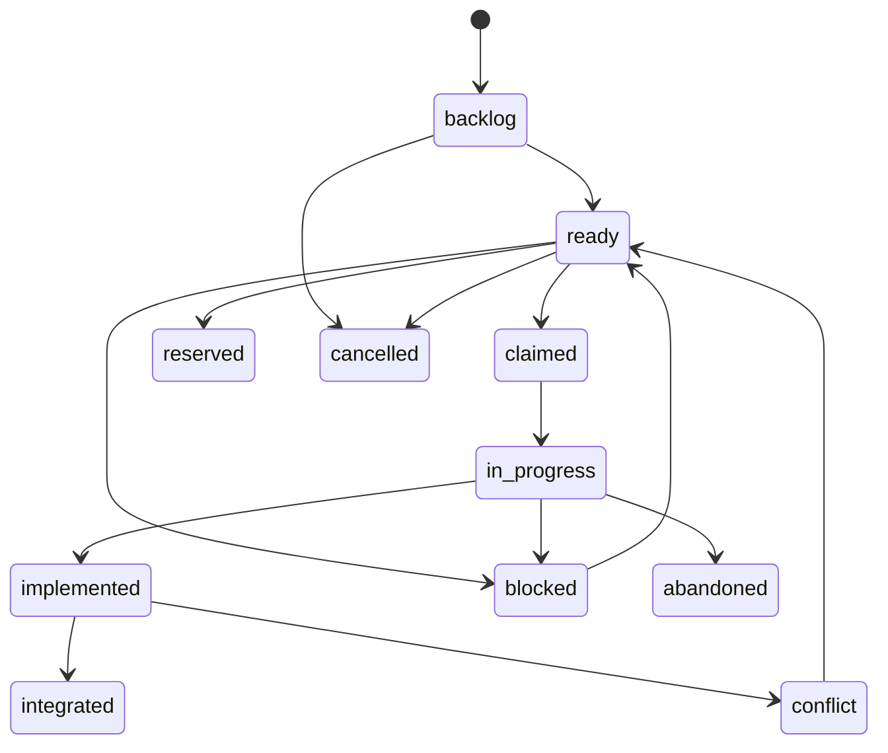

# Tascade Architecture (Current)

## High-Level Components

- API service (`app/main.py`): REST endpoints and static asset serving.
- Store layer (`app/store.py`): orchestration invariants and DB transactions.
- Auth layer (`app/auth.py`): API key auth, role checks, project-scope enforcement.
- MCP server (`app/mcp_server.py` + `app/mcp_tools.py`): agent tool interface.
- Metrics engine (`app/metrics_jobs.py`, `app/metrics/*`): compute and read model.
- Web UI (`web/src/*`): read-only operations console and metrics dashboards.

## Execution State Machine

Notes:
- `claimed` and `reserved` are acquired through dedicated operations (`claim`, `assign`).
- Material plan changes can invalidate active claims/reservations and return work to `ready`.

## Authorization Model

- Auth principal: API key with `project_id` scope + `role_scopes`.
- Roles: `planner`, `agent`, `reviewer`, `operator`, `admin`.
- Read endpoints are authenticated; write endpoints enforce role checks.
- Project-scoped keys cannot operate outside their scoped project.

## Gate and Review Model

- Gate policies can generate checkpoint tasks (`review_gate`, `merge_gate`).
- Gate decisions are auditable records with actor/reason/evidence.
- Integration transition enforces explicit review evidence and anti-self-review rules.

## Data and Migrations

- SQLAlchemy models in `/Users/sayeedanjum/projects/tascade/app/models.py`.
- Postgres migrations in `/Users/sayeedanjum/projects/tascade/docs/db/migrations/`.
- Startup applies missing migrations and tracks them in `schema_migrations`.

## Frontend Surface

- Project list
- Workspace tasks/checkpoints view
- Task detail panel
- Metrics dashboard

All writes remain API/MCP-driven; the web UI is a read-first console.
